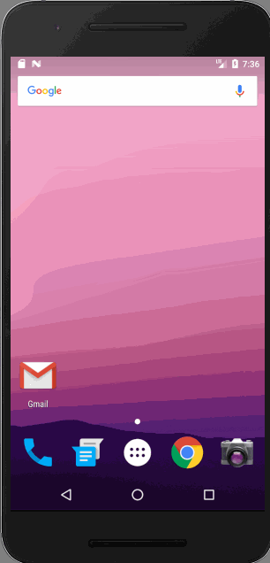

# Android_MVP_Sample

This is an android app sample which shows how to build simple Android app based on MVP pattern

## Video Walkthrough

## User Stories

* [x] Browse list of restaurants based on lat & long input values
* [x] Toggle restaurant as favorite by clicking a favorite button on each cell
* [x] Favorite selection persists across app restarts
* [x] When lists reloaded favorites are pushed to the top of the list
* [x] Includes Unit Tests

